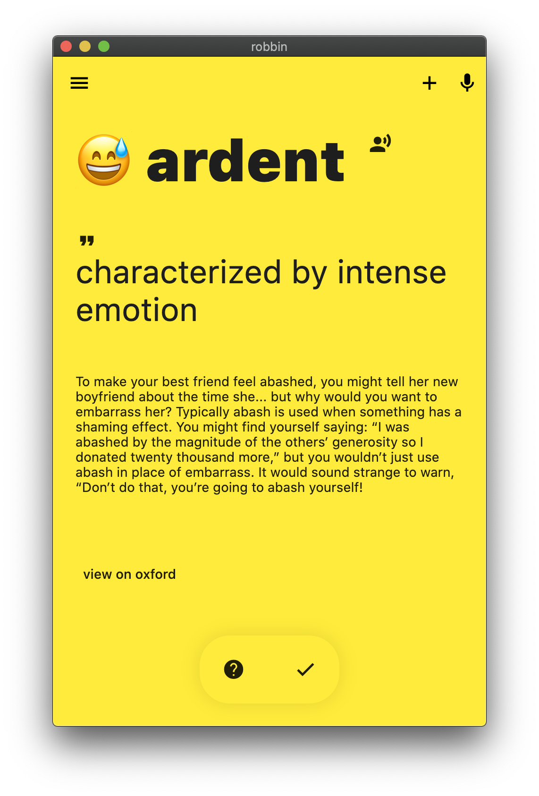

# WOR.IO

modern vocabulary leaning app for SAT/GRE students.

**supported native human languages**

- KOREAN (ko-KR)
- ENGLISH (en-US)

**project structure**

- /app - word app main folder built on flutter
- /server - service server built on deno
- /core. - nlp & logic containers

## app

## engine

wor.io uses inked-engin for internal nlp engine processing.
https://github.com/softmarshmallow/inked-engine
